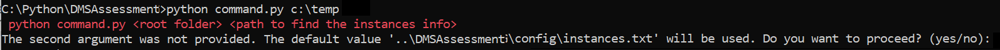
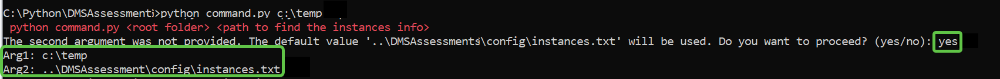
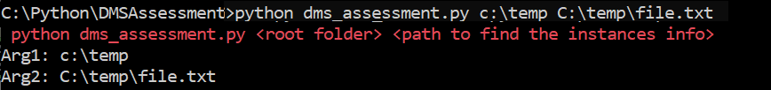
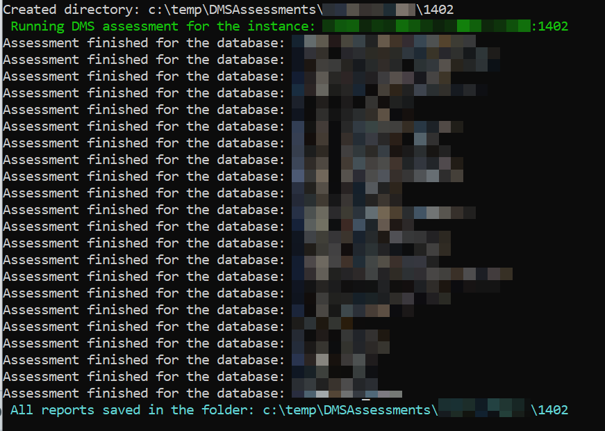

# Run AWS DMS Assesment for all databases in any number of instances

## Folder structure

    |_\Path
        |DMSASSESSMENT
        ├── config/
        |     └── instances.txt
        ├── utils/
        |     ├── __init__.py    # Empty file to indicate this is a package
        │     └── colors.py  # Shared functions
        |── awsdms_support_collector_sql_server.sql # script provided by aws
        └── dms_assessment.py #main script
    
## Requisites

- Install **Python 3.12**
- Credentials for the migrationuserwX (X= wave number)
- The file **instances.txt** is already created in the config folder. It's possible to fill it with the target servers, or you can provide a diferent file, and send the full path as second argument to the python script.
- Either if you are using the config\instances.txt or anyother, you must comply the following requisites:
    
    
    a. **one line per instance** 
    
    b. the format must be like the ones provided as example below: (user and password will be the ones created for the migration):
    
    servername.int.abrigo.app,PORT1,migrationuserwX,PASSWORD
    
    servername.int.abrigo.app,PORT2,migrationuserwX,PASSWORD
    
    servername2.int.abrigo.app,PORT2,migrationuserwX,PASSWORD
- Save it.

## Execution: Path\DMSASSESSMENT>python dms_assessment.py \<root folder> \<path to find the instances info>
- Open a cmd window on the directory where the python script **dms_assessment.py** is located
- Copy the root path (which is a mandatory argument) and the instances.txt file path (optional). 
### Execute the script: Scenario1 python dms_assessment.py \<root folder>
- You'll receive the following message:

- If you write no, the execution finishes. On the other hand , by writing **yes**, you'll get the values to be use for this execution:

### Execute the script: Scenario1 python dms_assessment.py \<root folder> \<path to find the instances info>
- You get the informational message, and it will start executing immediately:

## Output of the execution
1. The script will loop through the lines in the instances file
2. Will create (recreate if exists) the **DMSAssessments** folder in the path folder sent as Arg1
3. Will grab line by line, and create the subfolder for the Server and inside it, another subfolder with the port number
4. Will execute the sqlcmd for all the databases in that instance and save the result in the path generated above:

